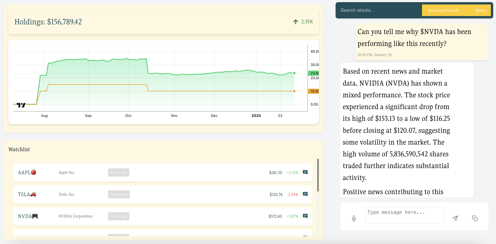
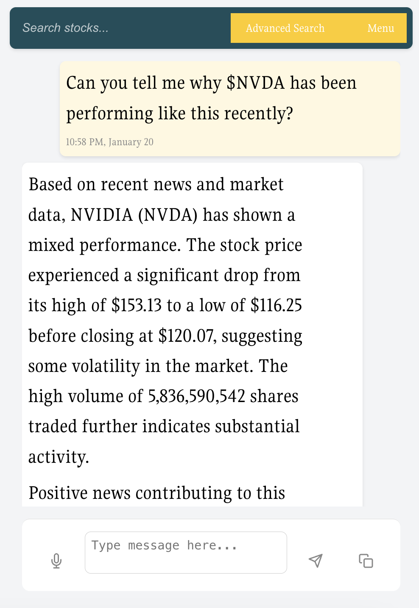

# StockSavvy

### Introduction

StockSavvy is a web application designed to help you keep up to date on your investments with AI. Started as part of the ConUHacks hackathon in 2025, the project is currently a work in progress.

---

### Active Features

1. A Golang API backend that:
   1. Provides a Google Gemini-powered chat for stock inquiries, using recent news articles
   2. Gathers relevant, real-world stock data
   3. Stores the user's stock holdings (WIP)
2. A React frontend that:
   1. Displays the status and history of your current investments
   2. Allows you to chat with the AI chatbot assistant
   3. Provides data on current stock trends

### The chatbot

To see a demo of the chatbot, click on this video link:

---

### WIP Features

1. Storage of user's stock holding data
2. Improved fetching of current stock data

---

##### Authors: Yash Patel, David Ruiz, and Kai Turanski
